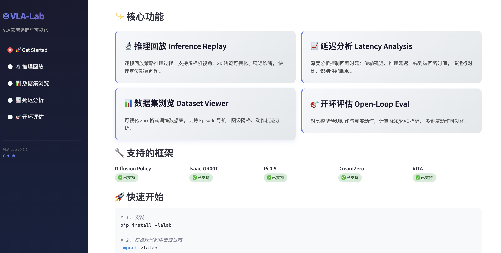
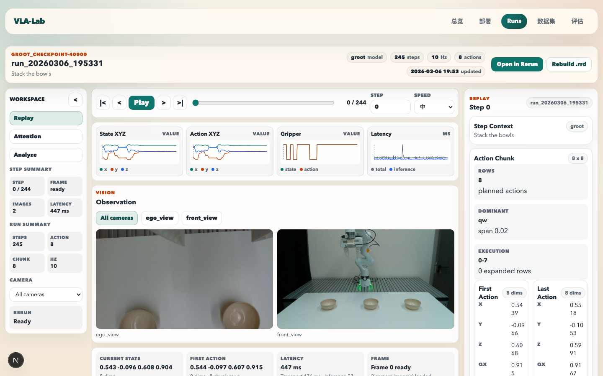
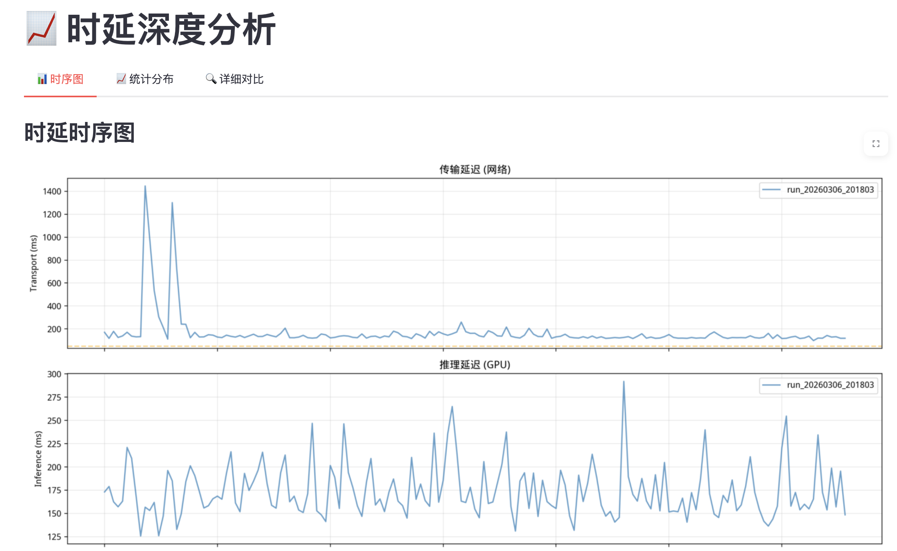
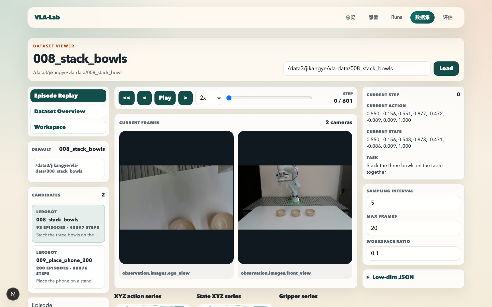
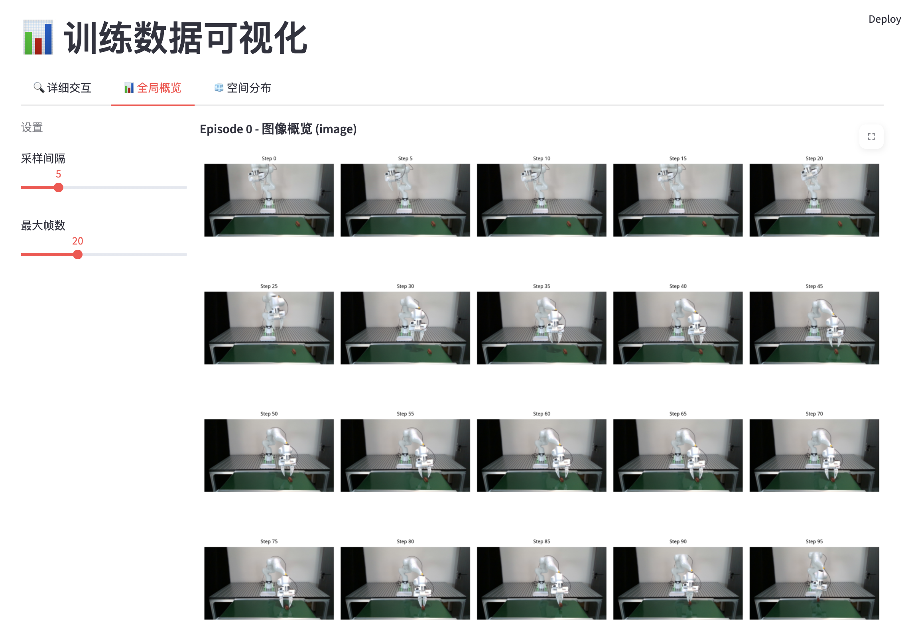
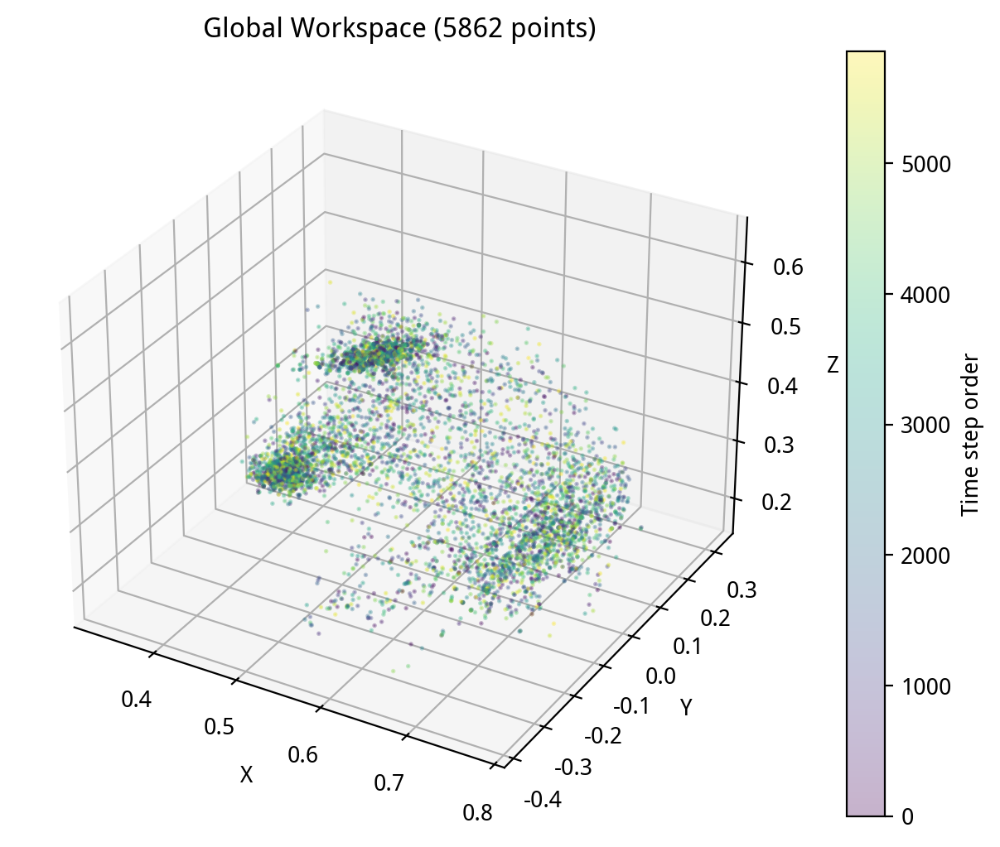
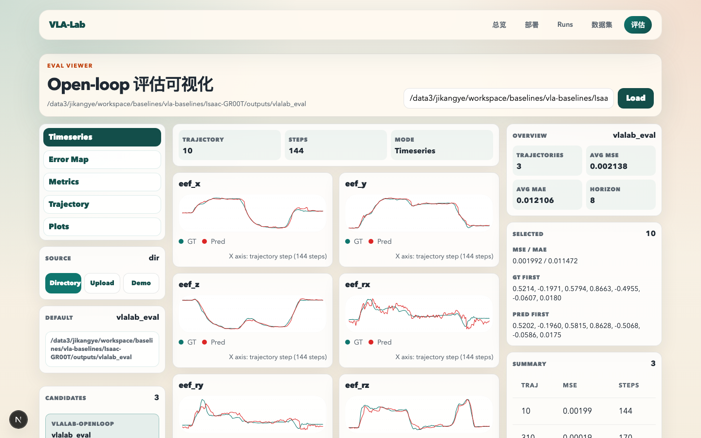

<div align="center">
  
# 🦾 VLA-Lab

### The Missing Toolkit for Vision-Language-Action Model Deployment

[](https://www.python.org/downloads/)
[](https://opensource.org/licenses/MIT)
[](https://pypi.org/project/vlalab/)

**Log · Replay · Analyze · Evaluate** — 一站式 VLA 实机部署工具箱

[🚀 Quick Start](#-quick-start) · [📸 Screenshots](#-screenshots) · [🎯 Features](#-features) · [🔧 Installation](#-installation)

</div>

---

## 🎯 Why VLA-Lab?

将 VLA 模型部署到真实机器人充满挑战：

- 🕵️ **黑盒推理** — 无法看到模型"看到了什么"或为什么失败
- ⏱️ **隐藏时延** — 传输延迟、推理瓶颈、控制回路时序不透明
- 📊 **日志碎片化** — 每个框架日志格式不同，跨模型对比极其痛苦
- 🔄 **调试低效** — 复现故障需手动解析日志并逐步可视化

**VLA-Lab 解决这一切。** 统一的日志格式 + 交互式可视化面板，覆盖从数据采集到开环评估的完整工作流。

---

## ✨ Features

<table>
<tr>
<td width="50%">

### 🔬 推理回放 Inference Replay
逐帧回放策略推理过程：多相机画面、3D 末端轨迹、全维度状态/动作曲线，一键定位部署故障。

### 📊 数据集浏览 Dataset Viewer
交互式浏览 Zarr 格式训练数据：逐帧分析、全局统计概览、工作空间分布热力图。

</td>
<td width="50%">

### 📈 时延深度分析 Latency Analysis
分解传输延迟、GPU 推理延迟、端到端回路时间，时序图 + 统计分布 + 多运行对比，快速识别瓶颈。

### 🎯 开环评估 Open-Loop Eval
对比模型预测动作与真实动作：MSE / MAE 指标汇总、时序对比、误差热力图、3D 轨迹叠加。

</td>
</tr>
</table>

### 🔧 支持的框架

| 框架 | 状态 |
|:---|:---:|
| **Diffusion Policy** | ✅ 已支持 |
| **Isaac-GR00T** | ✅ 已支持 |
| **Pi 0.5** | ✅ 已支持 |
| **DreamZero** | ✅ 已支持 |
| **VITA** | ✅ 已支持 |

> VLA-Lab 采用统一日志协议，适配新框架仅需几行胶水代码。

---

## 📸 Screenshots

<table>
<tr>
<td colspan="2" align="center">

#### 🚀 Get Started — 核心功能总览


</td>
</tr>
<tr>
<td align="center" width="50%">

#### 🔬 推理回放

<sub>多相机画面 · 3D 末端轨迹 · 状态/动作全维曲线</sub>

</td>
<td align="center" width="50%">

#### 📈 时延深度分析

<sub>传输 & 推理延迟时序图 · 统计分布 · 多运行对比</sub>

</td>
</tr>
<tr>
<td align="center" width="50%">

#### 📊 数据集逐帧分析

<sub>相机画面 · 机器人状态 · 时间轴滑动</sub>

</td>
<td align="center" width="50%">

#### 📊 数据集全局概览

<sub>Episode 统计 · 动作分布 · 图像网格</sub>

</td>
</tr>
<tr>
<td align="center" width="50%">

#### 📊 工作空间分布

<sub>3D 工作空间采样密度可视化</sub>

</td>
<td align="center" width="50%">

#### 🎯 开环评估

<sub>MSE/MAE 汇总 · 时序对比 · 误差热力图 · 3D 轨迹</sub>

</td>
</tr>
</table>

---

## 🔧 Installation

```bash
pip install vlalab
```

安装完整依赖（含 Zarr 数据集支持）：

```bash
pip install vlalab[full]
```

或从源码安装：

```bash
git clone https://github.com/ky-ji/VLA-Lab.git
cd VLA-Lab
pip install -e .
```

---

## 🚀 Quick Start

### Minimal Example (3 Lines!)

```python
import vlalab

# Initialize a run
run = vlalab.init(project="pick_and_place", config={"model": "diffusion_policy"})

# Log during inference
vlalab.log({"state": obs["state"], "action": action, "images": {"front": obs["image"]}})
```

### Full Example

```python
import vlalab

# Initialize with detailed config
run = vlalab.init(
    project="pick_and_place",
    config={
        "model": "diffusion_policy",
        "action_horizon": 8,
        "inference_freq": 10,
    },
)

# Access config anywhere
print(f"Action horizon: {run.config.action_horizon}")

# Inference loop
for step in range(100):
    obs = get_observation()
    
    t_start = time.time()
    action = model.predict(obs)
    latency = (time.time() - t_start) * 1000
    
    # Log everything in one call
    vlalab.log({
        "state": obs["state"],
        "action": action,
        "images": {"front": obs["front_cam"], "wrist": obs["wrist_cam"]},
        "inference_latency_ms": latency,
    })

    robot.execute(action)

# Auto-finishes on exit, or call manually
vlalab.finish()
```

### Launch Visualization

```bash
# One command to view all your runs
vlalab view
```

---

## 📖 Documentation

### Core Concepts

**Run** — A single deployment session (one experiment, one episode, one evaluation)

**Step** — A single inference timestep with observations, actions, and timing

**Artifacts** — Images, point clouds, and other media saved alongside logs

### API Reference

<details>
<summary><b>vlalab.init() — Initialize a run</b></summary>

```python
run = vlalab.init(
    project: str = "default",     # Project name (creates subdirectory)
    name: str = None,             # Run name (auto-generated if None)
    config: dict = None,          # Config accessible via run.config.key
    dir: str = "./vlalab_runs",   # Base directory (or $VLALAB_DIR)
    tags: list = None,            # Optional tags
    notes: str = None,            # Optional notes
)
```

</details>

<details>
<summary><b>vlalab.log() — Log a step</b></summary>

```python
vlalab.log({
    # Robot state
    "state": [...],                    # Full state vector
    "pose": [x, y, z, qx, qy, qz, qw], # Position + quaternion
    "gripper": 0.5,                    # Gripper opening (0-1)
    
    # Actions
    "action": [...],                   # Single action or action chunk
    
    # Images (multi-camera support)
    "images": {
        "front": np.ndarray,           # HWC numpy array
        "wrist": np.ndarray,
    },
    
    # Timing (any *_ms field auto-captured)
    "inference_latency_ms": 32.1,
    "transport_latency_ms": 5.2,
    "custom_metric_ms": 10.0,
})
```

</details>

<details>
<summary><b>RunLogger — Advanced API</b></summary>

For fine-grained control over logging:

```python
from vlalab import RunLogger

logger = RunLogger(
    run_dir="runs/experiment_001",
    model_name="diffusion_policy",
    model_path="/path/to/checkpoint.pt",
    task_name="pick_and_place",
    robot_name="franka",
    cameras=[
        {"name": "front", "resolution": [640, 480]},
        {"name": "wrist", "resolution": [320, 240]},
    ],
    inference_freq=10.0,
)

logger.log_step(
    step_idx=0,
    state=[0.5, 0.2, 0.3, 0, 0, 0, 1, 1.0],
    action=[[0.51, 0.21, 0.31, 0, 0, 0, 1, 1.0]],
    images={"front": image_rgb},
    timing={
        "client_send": t1,
        "server_recv": t2,
        "infer_start": t3,
        "infer_end": t4,
    },
)

logger.close()
```

</details>

### CLI Commands

```bash
# Launch visualization dashboard
vlalab view [--port 8501]

# Convert legacy logs (auto-detects format)
vlalab convert /path/to/old_log.json -o /path/to/output

# Inspect a run
vlalab info /path/to/run_dir
```

---

## 📁 Run Directory Structure

```
vlalab_runs/
└── pick_and_place/                 # Project
    └── run_20240115_103000/        # Run
        ├── meta.json               # Metadata (model, task, robot, cameras)
        ├── steps.jsonl             # Step records (one JSON per line)
        └── artifacts/
            └── images/             # Saved images
                ├── step_000000_front.jpg
                ├── step_000000_wrist.jpg
                └── ...
```

---

## 🗺️ Roadmap

- [x] Core logging API & unified run format
- [x] Streamlit visualization suite (5 pages)
- [x] Diffusion Policy adapter
- [x] Isaac-GR00T adapter
- [x] Pi 0.5 adapter
- [x] DreamZero adapter
- [x] VITA adapter
- [x] Open-loop evaluation pipeline
- [ ] Cloud sync & team collaboration
- [ ] Real-time streaming dashboard
- [ ] Automatic failure detection
- [ ] Integration with robot simulators

---

## 🤝 Contributing

We welcome contributions! 

```bash
git clone https://github.com/ky-ji/VLA-Lab.git
cd VLA-Lab
pip install -e ".[dev]"
```

---

## 📄 License

MIT License — see [LICENSE](LICENSE) for details.

---

<div align="center">
  
**⭐ Star us on GitHub if VLA-Lab helps your research!**

*Built with ❤️ for the robotics community*

</div>
